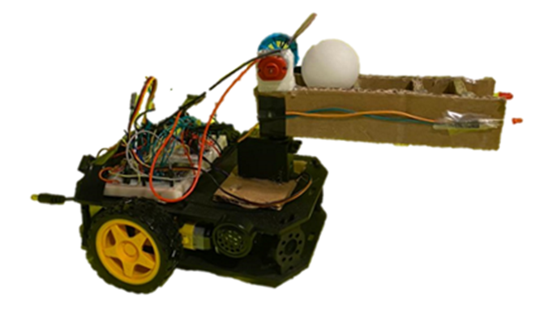
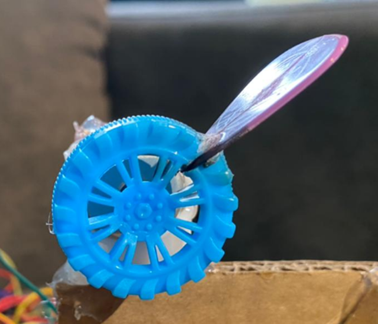
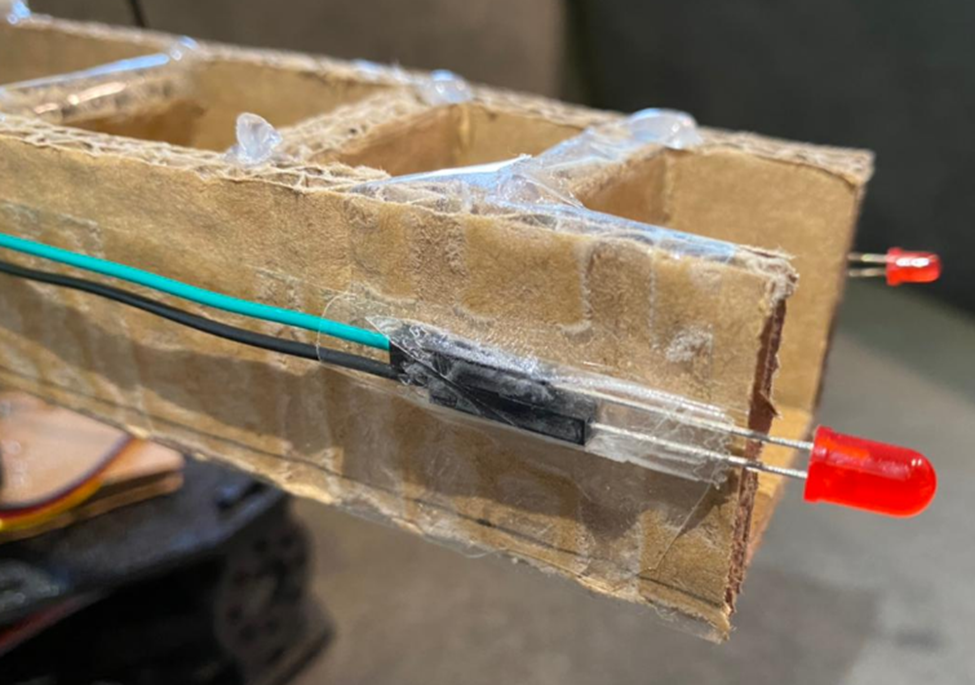
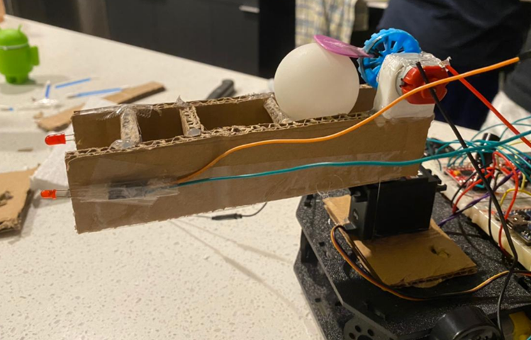
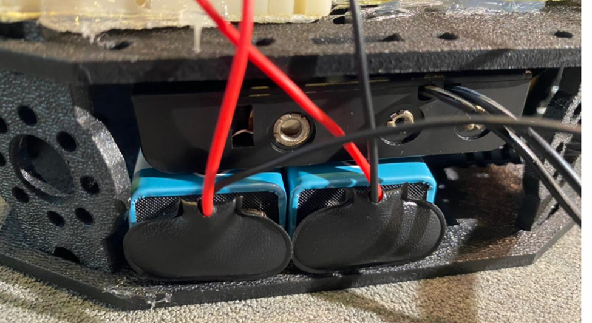
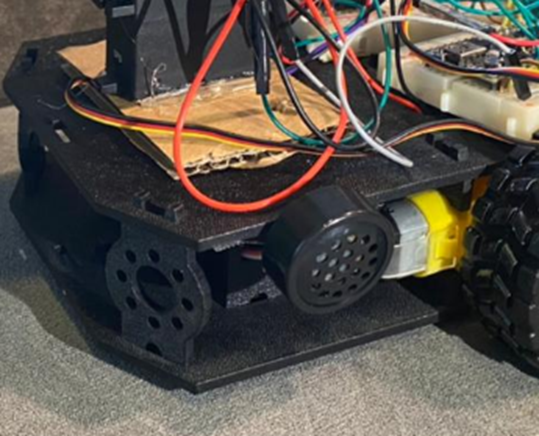
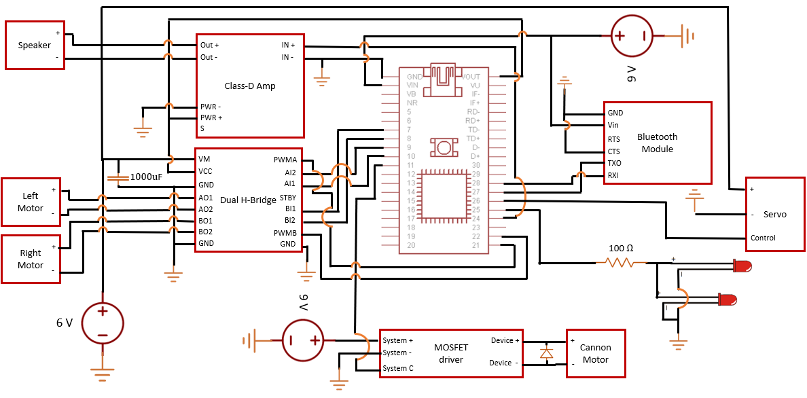

# Smart-Tank
Lucas Katayama, Bruno Rigo, Arthur Siqueira



## Summary

The Smart Tank is a robot tank controlled by Bluetooth with the Bluefruit app. Through the app, the user can move the robot by using the arrows on the interface and shoot the ball by pressing the “1” button. The robot is able to move by using two DC motors, move its barrel around a vertical axis with a servo motor, and shoot a ping pong ball by using a DC motor connected to a kicking mechanism. Additionally, when the robot shoots the ball, light and sound effects are emitted by using LEDs and a speaker with a Class-D amplifier. The robot is controlled by a single ARM Mbed.

## Parts List

1 x ARM Mbed microcontroller

2 x Shadow chassis motor

1 x Adafruit Bluefruit LE UART Friend BLE

1 x Servo - Hitec HS-422 (Standard Size)

1 x DC motor 3-12 V

1 x 1N4001 

2 x Red LED

1 x Speaker

1 x SparkFun Mono Audio Amp Breakout - TPA2005D1

1 x SparkFun Motor Driver with headers

1 x Toy wheel

1 x Guitar pick

2 x Battery clip

1 x 4xAA Battery Holder

1 x Switch

1 x Shadow Chassis

1 x SparkFun MOSFET Power Control Kit 

2 x Wheel - 65mm (Rubber Tire)

2 x Breadboards

1x DC Barrel Jack Adapter - Breadboard Compatible

1 x 1000uF Capacitor

Cardboard

Wires

## Hardware Assembling

For assembling the Smart Tank, we mostly used prototyping equipment and materials that were easy to acquire. The team’s intention is to allow this project to be easily replicable. Thus, we created the following steps to instruct others with the system design.
  
First, we assembled the tank cannon by using cardboard pieces and hot glue and then attached it to the servo. Then, we glued the guitar pick to a hole we made in the toy wheel, as shown in Figure 1. The next step is to attach the wheel to the motor’s axis and glue the motor to the cannon body. Finally, we can connect the LEDs to the tip of the cannon in the location shown in Figure 2. In the end, you would have a cannon barrel similar to the one shown in Figure 3.



Figure 1. Close up of the kicking mechanism.



Figure 2. Location of the LEDS.



Figure 3. Close up of the cannon’s barrel.

We assembled the Shadow Bot chassis by following the instructions of its [manufacturer](https://learn.sparkfun.com/tutorials/assembly-guide-for-redbot-with-shadow-chassis). With the chassis in hands, we attached a cardboard piece to cover the hole in its front and attached the servo on top of it. Then, we can attach all the batteries, the speaker, and the breadboards to the chassis.



Figure 4. Batteries attached to the chassis.



Figure 5. Close-up of speaker and servo location on the Shadow Bot chassis.

We then used two breadboards and three power supplies according to make the electrical stack of our system. A 6 V battery pack feeds the Class-D amplifier, the dual H-Bridge, the servo, and the speaker. A 9 V battery powers the Bluetooth module, and the Mbed. Another 9 V battery is used to provide energy to the Brushed DC motor in the kicking mechanism in order to launch the ping-pong ball a greater distance.
   
All the connections of the individual components to the Mbed and their respective power supplies are listed in Table 1 and shown in the schematics in Figure 6.

**Table 1: Component connections**
<table>
<tbody>
<tr>
<td>
<p><span style="font-weight: 400;">Component</span></p>
</td>
<td>
<p><span style="font-weight: 400;">Component pins</span></p>
</td>
<td>
<p><span style="font-weight: 400;">Circuit connection</span></p>
</td>
</tr>
<tr>
<td rowspan="5">
<p><span style="font-weight: 400;">Adafruit Bluetooth Module</span></p>
</td>
<td>
<p><span style="font-weight: 400;">Gnd</span></p>
</td>
<td>
<p><span style="font-weight: 400;">Gnd</span></p>
</td>
</tr>
<tr>
<td>
<p><span style="font-weight: 400;">Vin</span></p>
</td>
<td>
<p><span style="font-weight: 400;">+9 V [battery 1]</span></p>
</td>
</tr>
<tr>
<td>
<p><span style="font-weight: 400;">CTS</span></p>
</td>
<td>
<p><span style="font-weight: 400;">Gnd</span></p>
</td>
</tr>
<tr>
<td>
<p><span style="font-weight: 400;">TXO</span></p>
</td>
<td>
<p><span style="font-weight: 400;">p27</span></p>
</td>
</tr>
<tr>
<td>
<p><span style="font-weight: 400;">RXI</span></p>
</td>
<td>
<p><span style="font-weight: 400;">p28</span></p>
</td>
</tr>
<tr>
<td rowspan="14">
<p><span style="font-weight: 400;">Dual H-Bridge</span></p>
</td>
<td>
<p><span style="font-weight: 400;">VM</span></p>
</td>
<td>
<p><span style="font-weight: 400;">+6 V with decoupling capacitor</span></p>
</td>
</tr>
<tr>
<td>
<p><span style="font-weight: 400;">VCC</span></p>
</td>
<td>
<p><span style="font-weight: 400;">Vout [Mbed]</span></p>
</td>
</tr>
<tr>
<td>
<p><span style="font-weight: 400;">Gnd</span></p>
</td>
<td>
<p><span style="font-weight: 400;">Gnd</span></p>
</td>
</tr>
<tr>
<td>
<p><span style="font-weight: 400;">AO1</span></p>
</td>
<td>
<p><span style="font-weight: 400;">Left motor&nbsp; +</span></p>
</td>
</tr>
<tr>
<td>
<p><span style="font-weight: 400;">AO2</span></p>
</td>
<td>
<p><span style="font-weight: 400;">Left motor -</span></p>
</td>
</tr>
<tr>
<td>
<p><span style="font-weight: 400;">BO2</span></p>
</td>
<td>
<p><span style="font-weight: 400;">Right motor -</span></p>
</td>
</tr>
<tr>
<td>
<p><span style="font-weight: 400;">BO1</span></p>
</td>
<td>
<p><span style="font-weight: 400;">Right motor +</span></p>
</td>
</tr>
<tr>
<td>
<p><span style="font-weight: 400;">PWMA</span></p>
</td>
<td>
<p><span style="font-weight: 400;">p22 [Mbed]</span></p>
</td>
</tr>
<tr>
<td>
<p><span style="font-weight: 400;">AI2</span></p>
</td>
<td>
<p><span style="font-weight: 400;">p9 [Mbed]</span></p>
</td>
</tr>
<tr>
<td>
<p><span style="font-weight: 400;">AI1</span></p>
</td>
<td>
<p><span style="font-weight: 400;">p10 [Mbed]</span></p>
</td>
</tr>
<tr>
<td>
<p><span style="font-weight: 400;">STBY</span></p>
</td>
<td>
<p><span style="font-weight: 400;">Vout [Mbed]</span></p>
</td>
</tr>
<tr>
<td>
<p><span style="font-weight: 400;">BI1</span></p>
</td>
<td>
<p><span style="font-weight: 400;">p7 [Mbed]</span></p>
</td>
</tr>
<tr>
<td>
<p><span style="font-weight: 400;">BI2</span></p>
</td>
<td>
<p><span style="font-weight: 400;">p8 [Mbed]</span></p>
</td>
</tr>
<tr>
<td>
<p><span style="font-weight: 400;">PWMB</span></p>
</td>
<td>
<p><span style="font-weight: 400;">p21 [Mbed]</span></p>
</td>
</tr>
<tr>
<td rowspan="6">
<p><span style="font-weight: 400;">Class-D Amplifier</span></p>
</td>
<td>
<p><span style="font-weight: 400;">IN +</span></p>
</td>
<td>
<p><span style="font-weight: 400;">p24 [Mbed]</span></p>
</td>
</tr>
<tr>
<td>
<p><span style="font-weight: 400;">IN -</span></p>
</td>
<td>
<p><span style="font-weight: 400;">Gnd</span></p>
</td>
</tr>
<tr>
<td>
<p><span style="font-weight: 400;">OUT +</span></p>
</td>
<td>
<p><span style="font-weight: 400;">Speaker +</span></p>
</td>
</tr>
<tr>
<td>
<p><span style="font-weight: 400;">OUT -</span></p>
</td>
<td>
<p><span style="font-weight: 400;">Speaker -</span></p>
</td>
</tr>
<tr>
<td>
<p><span style="font-weight: 400;">PWR +</span></p>
</td>
<td>
<p><span style="font-weight: 400;">Vout [Mbed]</span></p>
</td>
</tr>
<tr>
<td>
<p><span style="font-weight: 400;">PWR -</span></p>
</td>
<td>
<p><span style="font-weight: 400;">Gnd</span></p>
</td>
</tr>
<tr>
<td rowspan="5">
<p><span style="font-weight: 400;">MOSFET driver</span></p>
<p><span style="font-weight: 400;">(There is a diode from Device - to Device +)&nbsp;</span></p>
</td>
<td>
<p><span style="font-weight: 400;">Device +</span></p>
</td>
<td>
<p><span style="font-weight: 400;">DC motor +</span></p>
</td>
</tr>
<tr>
<td>
<p><span style="font-weight: 400;">Device -&nbsp;</span></p>
</td>
<td>
<p><span style="font-weight: 400;">DC motor -&nbsp;</span></p>
</td>
</tr>
<tr>
<td>
<p><span style="font-weight: 400;">System +</span></p>
</td>
<td>
<p><span style="font-weight: 400;">+9 V [battery 2]</span></p>
</td>
</tr>
<tr>
<td>
<p><span style="font-weight: 400;">System -</span></p>
</td>
<td>
<p><span style="font-weight: 400;">Gnd</span></p>
</td>
</tr>
<tr>
<td>
<p><span style="font-weight: 400;">System C</span></p>
</td>
<td>
<p><span style="font-weight: 400;">p11 [MBED]</span></p>
</td>
</tr>
<tr>
<td rowspan="2">
<p><span style="font-weight: 400;">LED</span></p>
</td>
<td>
<p><span style="font-weight: 400;">+</span></p>
</td>
<td>
<p><span style="font-weight: 400;">P25 [MBED] with 100 resistor in series</span></p>
</td>
</tr>
<tr>
<td>
<p><span style="font-weight: 400;">-</span></p>
</td>
<td>
<p><span style="font-weight: 400;">Gnd</span></p>
</td>
</tr>
</tbody>
</table>



Figure 6. Schematics of the Smart Tank circuit.

## Firmware Development

```C++
#include "mbed.h"
#include "Servo.h"
#include "Motor.h"

DigitalOut led(p25); // RED LEDs
PwmOut spkr(p24); // Speaker
Servo servo(p26); // Servo
Motor right(p21, p7, p8); // pwm, fwd, rev
Motor left(p22, p9, p10); // pwm, fwd, rev
RawSerial  blue(p28,p27); // bluetooth
DigitalOut fire(p11); // DC motor for kicking

float servo_pos = 0.5;
```

The first few lines of code serve to declare the libraries we are importing and the pins we are using. To control the servo we use the Mbed Servo library, and to control the DC motors responsible for movement we use a modified version of the Mbed Motor library. In our modification, we removed the line that set the initial PWM period to 0.001 seconds, as there is only one PWM unit on the Mbed and the servo uses a specific pulse period to adjust its position. We also decided to not use RTOS to create multiple threads as we were getting runtime errors when using the Servo.h library, but that did not alter the expected performance of the tank since it did not need to perform any parallel actions. Moreover, a variable called servo_pos was defined to determine the position of the servo.

```C++
void sound(){
    spkr = 0.5; // Set speaker volume to maximum
    for (float f = 1.0; f < 510; f +=25) {
        led = !led; // Change LEDs between on and off
        spkr.period(1.0/f); // Changes the frequency of the speaker
        spkr = 0.5; // Solve some issues with changing volume
        wait(0.05); // Gives some time for the sound to play
    }
    led = 0; // Turn off LED
    spkr = 0; // Turn off speaker
    spkr.period(0.02); // reset for servo
}
```

To make the sound and light effects, we created the subroutine “sound”. Using a for loop, the LEDs are rapidly turned on and off while the frequency of the sound emitted by the speaker is increased. This increase in the speaker frequency serves to create a “charging” sound effect before the cannon fires. The speaker is set to its maximum volume every loop iteration in order to avoid an issue in which the volume becomes low while playing the sound effect. At the end of the subroutine, the LEDs are turned off and the frequency of the PWM output is set to be the same as the one the Servo library uses.

```C++
void shoot(){
    sound(); // Play the sound before launching the ball
    fire = 1; // Turn on kicking mechanism
    wait(0.12); // Wait for a complete rotation
    fire = 0; // Turn the kicking mechanism off
}
```

To better organize the code, we created a subroutine to control the kicking mechanism called “shoot”. It starts by calling the sound subroutine, then it turns on the DC motor to kick the ball, waits for a complete rotation, and finally turns off the DC motor.

```C++
int main(){
    servo = servo_pos; // Set servo initial position to center
    while(1) {
        if(blue.readable()) { // Check if there was a command
            char c;
            c = blue.getc(); // Check first character
            if (c == '!') {
                c = blue.getc(); // Check second character
                if (c == 'B') {
                    c = blue.getc(); // Get which button was pressed/released
                    char press = blue.getc(); // Get if it was a release or press
                    if (press == '1') { // if press
                        switch (c) {
                            case '1':  // button 1
                                shoot();
                                break;
                            
                            case '2': // button 2
                                break;
                                
                            case '3': // button 3
                                //barrel left
                                servo_pos = (servo_pos <= 0.1)? 0.0 : servo_pos-0.1; // make sure position is between 0 and 1
                                servo.write(servo_pos);
                                wait(0.2); // wait for servo to turn
                                break;
                            
                            case '4': // button 4
                                // barrel right
                                servo_pos = (servo_pos >= 0.9)? 1.0 : servo_pos+0.1;
                                servo.write(servo_pos); 
                                wait(0.2);
                                break;
                                
                            case '5': // up
                                left.speed(0.5);
                                right.speed(0.5); 
                                break;
                            
                            case '6': // down
                                left.speed(-0.5);
                                right.speed(-0.5);
                                break;
                                
                            case '7': // left
                                left.speed(0.5);
                                break;
                                
                            case '8': // right
                                right.speed(0.5);
                                break;
                                
                        }
                    } else { // if it was release
                        switch (c) {                                
                            case '5': // up
                                left.speed(0);
                                right.speed(0); 
                                break;
                            
                            case '6': // down
                                left.speed(0);
                                right.speed(0);
                                break;
                                
                            case '7': // left
                                left.speed(0);
                                break;
                                
                            case '8': // right
                                right.speed(0);
                                break;
                        }
                    }
                }
            }
        }
    }   
}
```

At the beginning of the main subroutine, the servo position is set to the center, so the cannon is always aligned to the tank axis when it is turned on. Then, the code waits for a Bluetooth signal to be received. The signals are interpreted as shown in Table 2. The speed of the motors was set to 50% of its maximum when moving to allow for better control and less power consumption. One could potentially use a less powerful motor, but in this project, we used the motors supplied with the class parts kit, so we throttled their performance. Moreover, the servo position is guaranteed to be always set between 0 and 1 with the use of a ternary expression.

**Table 2: Button codes and corresponding functionalities.**

| Button code press | Button code release | Button in Bluefruit app | Functionality          |
| ----------------- | ------------------- | ----------------------- | ---------------------- |
| “!B11”            | “!B10”              | 1                       | Shoots the ball        |
| “!B21”            | “!B20”              | 2                       | Not implemented        |
| “!B31”            | “!B30”              | 3                       | Turn the barrel left   |
| “!B41”            | “!B40”              | 4                       | Turn the barrel right  |
| “!B51”            | “!B50”              | Up                      | Move the tank forward  |
| “!B61”            | “!B60”              | Down                    | Move the tank backward |
| “!B71”            | “!B70”              | Left                    | Turn the tank left     |
| “!B81”            | “!B80”              | Right                   | Turn the tank right    |

## Conclusion

The Smart Tank managed to deliver a satisfactory performance while being easy to assemble. It serves as a great project for anyone who is seeking to get into embedded systems design while creating something fun and fully customizable. In the future, we aim to include a reloading system, so the tank can shoot multiple ping pong balls, and a servo to turn the barrel around the horizontal axis.

